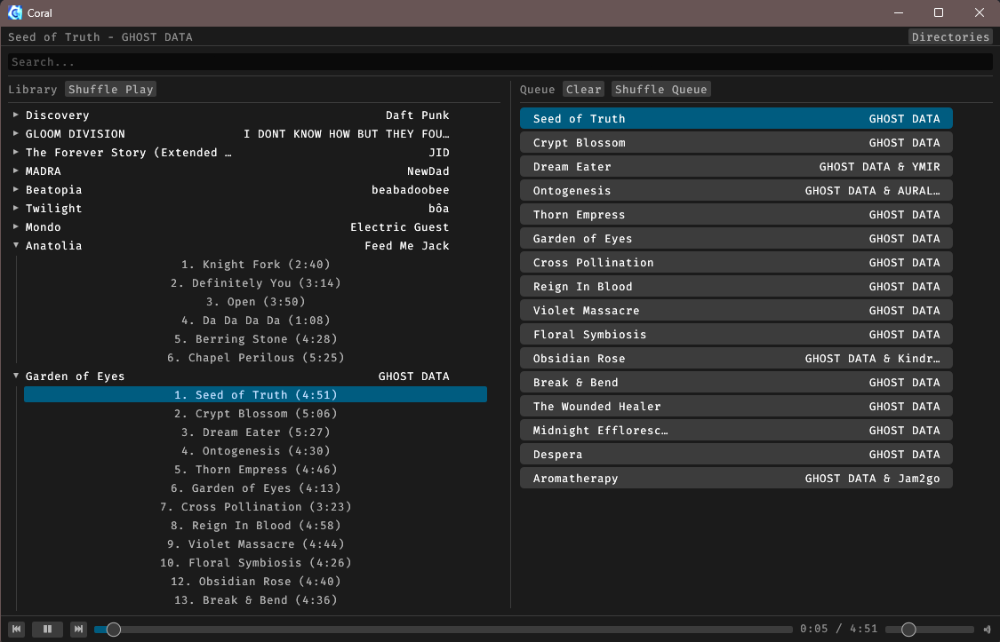

# Coral

A lightweight, fast music player** built in Rust. Designed for simplicity, minimal resource usage, and smooth playback.

 <!-- Optional: Replace with your image -->

## Features

- Add directories and scan local audio files (MP3, WAV, FLAC, etc.)
- ⏯ Basic controls: Play, Pause, Next, Previous
- Shuffle All and Queue Management 
- Lightweight and efficient

## Installation

### Prebuilt Binaries

Download the latest release from [Releases](https://github.com/will-ixs/Coral/releases).

### Build from Source

Make sure you have [Rust](https://www.rust-lang.org/tools/install) installed.

```bash
git clone https://github.com/will-ixs/Coral.git
cd Coral
cargo build --release
```

The compiled binary will be in:

```bash
target/release/Coral
```

## Usage

- Add a directory using the button in the top right
- Select any song to instantly play it, shuffle all loaded songs, or queue albums.

## Dependencies
Thank you to:
- discord-rich-presence = "1.0.0"
- eframe = {version = "0.32.3", features = ["persistence"]}
- egui = "0.32.3"
- egui_dnd = "0.13.0"
- image = "0.25.8"
- lofty = "0.22.4"
- rand = "0.9.2"
- rfd = "0.15.4"
- rodio = {version = "0.21.1", features = ["symphonia-all", "playback"] }
